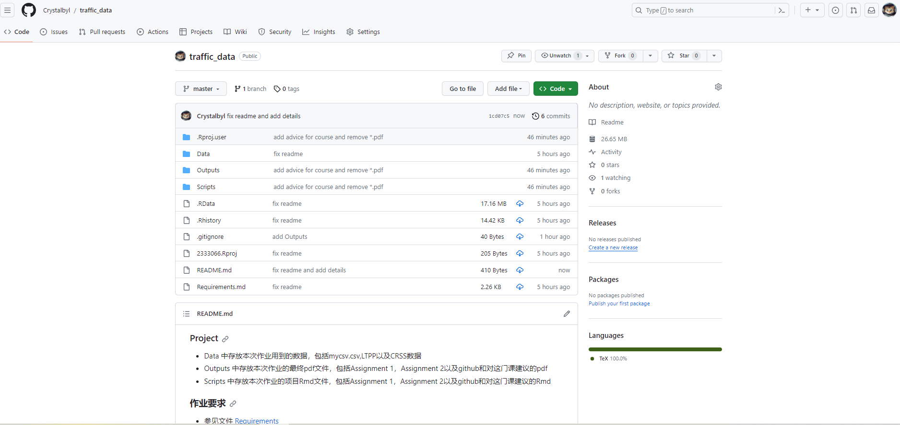

```{r setup, include=FALSE}
knitr::opts_chunk$set(echo = TRUE)
```

## git use

**Push your homework to a git repository (bonus problem for 5 points)**

-   Provide a link to your repository as well as a screenshot of your repository
-   You can use an IDE or use the command line interface of git
-   Rstudio has a Git tab next to Connections and Tutorial

[**github链接**](https://github.com/Crystalbyl/traffic_data) \<-点击这里查看github页面



注：以上*github*由 *git bash* 维护

## advice for this course

-   希望这门课的MATLAB和R教学之前的导论部分精炼一些，私以为在导论和编程语言部分可以加入少部分**数据分析的算法理论部分**

-   希望MATLAB部分的教学有侧重点，可以分为基础语法、基本绘图、数据处理三部分，最后通过一个小项目进行总结所学，**私以为不用面面俱到，节约时间，发挥同学的主观能动性**

-   希望R语言的入门分为三个部分：基础语法、dplyr数据处理、ggplot2绘图以及最后的总结（或许可以以项目的形式进行，展开对某一数据集分析）

-   最后，个人的一点小意见，编程语言上，我比较希望加入python的教学，和MATLAB以及R之间进行权衡（**或许可以在导论时让同学们投票选择哪两门语言**）；编程语言教学上，感觉也不用从头开始，可以**跳过基本语法**，当然这需要同学们的积极配合和课前预习
